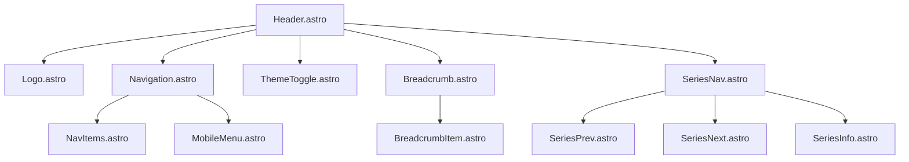
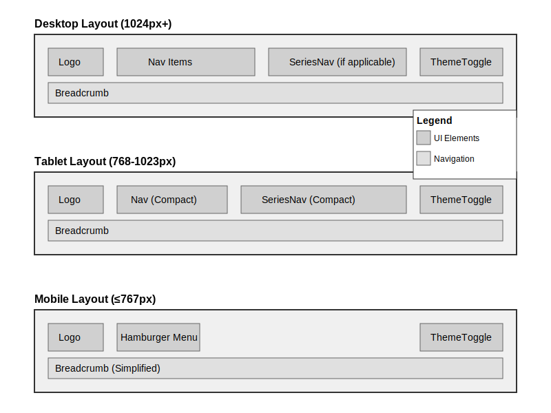

# AQZ Tech Chronicle 設計仕様書

## コンポーネント設計

### 基本レイアウト構成

#### ベースレイアウト (`/src/layouts/Layout.astro`)

```typescript
layouts/
  ├── Layout.astro        // 基本レイアウト
  └── BlogPost.astro      // ブログ記事用レイアウト
```

- ダークモードコンテキストの提供
- ベースヘッドコンポーネントの統合
- ViewTransitionsの実装
- 基本的なページ構造の提供

#### ヘッダー (`/src/components/Header/`)

```typescript
components/Header/
  ├── Header.astro        // メインヘッダー
  ├── Navigation.astro    // ナビゲーションメニュー
  ├── ThemeToggle.astro   // ダークモード切替
  └── SearchBar.astro     // 検索バー
```

**実装詳細**

- 固定ヘッダー（スクロール時も表示）
- レスポンシブなナビゲーションメニュー
  - モバイル時はハンバーガーメニュー
  - デスクトップ時は横並びメニュー
- ダークモード切替ボタン
  - LocalStorageでの設定保存
  - システム設定との連携
- 検索機能の統合

#### フッター (`/src/components/Footer/`)

```typescript
components/Footer/
  ├── Footer.astro        // メインフッター
  └── SocialLinks.astro   // ソーシャルリンク
```

**実装詳細**

- コピーライト表示
- 会社情報リンク
- プライバシーポリシーリンク
- GitHubリポジトリリンク

#### サイドバー (`/src/components/Sidebar/`)

```typescript
components/Sidebar/
  ├── Sidebar.astro       // メインサイドバー
  ├── Profile.astro       // プロフィール
  ├── Categories.astro    // カテゴリー一覧
  └── TagCloud.astro      // タグクラウド
```

**実装詳細**

- スティッキーポジショニング
- モバイル時は非表示（または下部に配置）
- プロフィール情報の表示
- カテゴリーナビゲーション
- 人気タグの表示

### ブログ関連コンポーネント

#### 記事コンポーネント (`/src/components/Blog/`)

```typescript
components/Blog/
  ├── ArticleCard.astro   // 記事プレビューカード
  ├── ArticleHeader.astro // 記事ヘッダー
  ├── ArticleMeta.astro   // 記事メタ情報
  ├── TOC.astro          // 目次
  └── SeriesNav.astro    // シリーズナビゲーション
```

**実装詳細**

- ヒーロー画像の最適化表示
- 記事メタ情報の表示
  - カテゴリー
  - タグ
  - 公開日/更新日
  - 読了時間
- シリーズ記事のナビゲーション
- 目次の自動生成
- 関連記事の表示

## ページ構造

### トップページ (`/src/pages/index.astro`)

- 最新記事のグリッド表示
- カテゴリーフィルター
- ページネーション
- 人気記事セクション

### 記事ページ (`/src/pages/blog/[slug].astro`)

- ヒーロー画像
- 記事ヘッダー（タイトル、メタ情報）
- 目次
- 本文
- シリーズナビゲーション
- 関連記事
- 著者プロフィール

### 静的ページ

- アバウトページ
- プロフィールページ
- プライバシーポリシー（外部リンク）

## テーマ実装

### ダークモード

- システム設定の検出
- 手動切替の実装
- 設定の永続化（LocalStorage）
- スムーズな切替アニメーション

### レスポンシブ設計

```typescript
// ブレークポイント
const breakpoints = {
  sm: '640px',   // スマートフォン
  md: '768px',   // タブレット
  lg: '1024px',  // ノートPC
  xl: '1280px',  // デスクトップ
  '2xl': '1536px'// 大画面
}
```

## コンテンツ管理

### 記事スキーマ

```typescript
interface Article {
  title: string;          // 記事タイトル
  description: string;    // 記事説明
  pubDate: Date;         // 公開日
  updatedDate: Date;     // 更新日
  heroImage: string;     // ヒーロー画像パス
  headline: string;      // 見出し
  category: string;      // カテゴリー
  tags: string[];        // タグ
  series?: {             // シリーズ情報（オプション）
    name: string;
    index: number;
  };
  draft: boolean;        // 下書きフラグ
  readingTime: number;   // 読了時間
}
```

### コンテンツコレクション

```typescript
src/content/
  ├── config.ts          // コレクション設定
  ├── blog/              // ブログ記事
  └��─ authors/          // 著者情報
```

### ユーティリティ関数 (`/src/utils/collections.ts`)

記事の取得と管理に関する共通のユーティリティ関数を提供します。

#### 主な機能

- 公開記事の取得
  - 下書きのフィルタリング（本番環境のみ）
  - 未来の公開日の記事の除外（本番環境のみ）
  - 開発環境ではすべての記事を表示
- 型安全性の確保
  - BlogPost 型の定義
  - Astroのコレクション型との連携

#### 使用例

```typescript
import { getPublishedPosts } from "@/utils/collections";

const allPosts = await getCollection("blog");
const publishedPosts = getPublishedPosts(allPosts as BlogPost[]);
```

## 自動化処理

### GitHub Actions

- ビルド・テスト自動化
- 画像最適化
- コンテンツ検証
- Cloudflare Pagesへのデプロイ
- 記事の自動公開

### 記事の自動公開

- 公開日時によるスケジュール管理
- 下書き状態の管理
- GitHub Actionsによる自動化

## パフォーマンス最適化

### 画像最適化

- Astroの画像最適化機能の利用
- WebP形式の使用
- 遅延読み込みの実装
- レスポンシブ画像の生成

### アセット最適化

- TailwindCSSの最適化
- コンポーネント単位のCSS Modules
- クライアントサイドJavaScriptの最小化
- 非重要リソースの遅延読み込み

## SEO対策

- 構造化データの実装
- サイトマップの生成
- RSSフィードの提供
- メタタグの最適化
- OGPタグの実装

## 分析ツール

- Google Analytics 4の設定
- プライバシーに配慮したトラッキング
- パフォーマンスモニタリング

## 開発ガイドライン

- コンポーネントベースの開発
- TypeScriptによる型安全性の確保
- 命名規則の統一
- ドキュメント作成要件
- テスト戦略

# ヘッダーコンポーネント設計仕様書

## 1. コンポーネント構成



## 2. コンポーネント詳細

### 2.1 Header.astro

- 役割: ヘッダー全体のコンテナ
- 実装:
  - スティッキーポジショニング
  - スクロール時の表示/非表示制御
  - 子コンポーネントのレイアウト管理
  - ダークモード対応

### 2.2 Breadcrumb.astro

- 役割: 現在位置の表示
- 構造:

```typescript
interface BreadcrumbItem {
  label: string;      // 表示名
  href: string;       // リンクURL
  current: boolean;   // 現在位置フラグ
}
```

- 実装:
  - Schema.orgのBreadcrumbList対応
  - アクセシビリティ対応（aria-label等）
  - モバイル時は省略表示（...）

### 2.3 SeriesNav.astro

- 役割: シリーズ記事のナビゲーション
- 表示条件: シリーズ記事閲覧時のみ
- 構造:

```typescript
interface SeriesNavInfo {
  seriesTitle: string;   // シリーズタイトル
  currentIndex: number;  // 現在の記事番号
  totalCount: number;    // 全記事数
  prevPost?: {           // 前の記事（オプション）
    title: string;
    slug: string;
  };
  nextPost?: {           // 次の記事（オプション）
    title: string;
    slug: string;
  };
}
```

## 3. レイアウト設計

### 3.1 デスクトップレイアウト（1024px以上）



## 4. インタラクション設計

### 4.1 スクロール挙動

- 下スクロール時:
  - ヘッダー非表示（ただしシリーズナビ表示中は常時表示）
- 上スクロール時:
  - ヘッダー表示
- 最上部:
  - 完全表示

### 4.2 シリーズナビゲーション

- デスクトップ:
  - インラインで前後の記事タイトルを表示
  - ホバーで詳細情報表示
- タブレット:
  - 前後の記事番号のみ表示
  - タップで詳細表示
- モバイル:
  - ドロップダウンメニューで表示
  - シリーズ一覧を含む

## 5. SEO対応

### 5.1 構造化データ

```typescript
const breadcrumbSchema = {
  "@context": "https://schema.org",
  "@type": "BreadcrumbList",
  "itemListElement": [
    {
      "@type": "ListItem",
      "position": 1,
      "name": "Home",
      "item": "https://aqz-tech.com"
    },
    {
      "@type": "ListItem",
      "position": 2,
      "name": "Category",
      "item": "https://aqz-tech.com/category/name"
    }
  ]
}
```

### 5.2 メタデータ

- 各ページに適切なタイトル設定
- パンくずリストによる構造化
- シリーズ情報の構造化データ対応

## 6. アクセシビリティ

- キーボードナビゲーション対応
- スクリーンリーダー対応
- ARIAラベルの適切な使用
- 十分なコントラスト比の確保

## 7. パフォーマンス最適化

- View Transitionsの活用
- 画像の最適化（Logo）
- JavaScriptの最小化
- CSSの最適化

# 技術ブログSEO設計仕様書

## 1. 基本方針

- シンプルで管理しやすい設計を維持
- 技術ブログとして必要な要素のみを実装
- 既存の実装(BaseHead.astro)をベースに必要な拡張を行う

## 2. メタデータ設計

### 基本情報

- タイトル
- 説明文
- 公開日/更新日
- カノニカルURL
- サイト情報（author, publisher）

### 技術記事用拡張

- プログラミング言語
- 技術カテゴリ
- シリーズ情報（該当する場合のみ）

## 3. 構造化データ設計

### 記事情報

- 記事タイプ（技術記事）
- 記事メタデータ
- カテゴリ/タグ情報

### シリーズ情報

- シリーズ名
- シリーズ内の位置
- 前後の記事リンク

## 4. 実装範囲

- 基本的なメタ情報の管理
- OGP対応
- 構造化データの提供
- シリーズ記事の関連付け
- 技術カテゴリの分類

この設計に基づき、既存のSEO実装を拡張することで、シンプルさを保ちながら技術ブログとして必要な対策を実現します。

# サイドバー設計仕様

## 1. 設計方針

- シンプルで必要最小限の情報提供
- 記事閲覧の妨げにならない構成
- 直感的なナビゲーション

## 2. 構成要素と配置

### 2.1 著者プロフィール（上部配置）

- プロフィール画像
- 著者名
- 一文の自己紹介（プロフィールページから引用）
- プロフィールページへのリンク

### 2.2 記事ナビゲーション（中部配置）

- カテゴリー一覧
  - カテゴリー名
  - 記事数（括弧書き）
- 最近の投稿（最新5件）
  - タイトルのみの表示
  - シンプルなリスト形式

### 2.3 検索機能（下部配置）

- 検索ボックス
- 検索結果は別ページで表示

## 3. レスポンシブ対応

### デスクトップ表示（1024px以上）

- 記事エリアの右側に固定表示
- すべての要素を表示

### タブレット表示（768px～1023px）

- 記事下部にグリッドレイアウトで配置
- すべての要素を横並びで表示

### モバイル表示（768px未満）

- 記事下部に縦並びで配置
- 最近の投稿：3件まで表示
- カテゴリー：アコーディオン形式

## 4. コンポーネント構成

- Profile
- Categories
- RecentPosts
- SearchBar

# 開発順序

1. 基盤コンポーネント（最初に実装）
Layout.astro

サイトの基本構造を定義
ダークモード対応の基盤
他のコンポーネントのコンテナとなる
BaseHead.astro

メタ情報の管理
SEO対応の基盤
スタイルシートの読み込み
2. 骨格コンポーネント（第二段階）
Header/Header.astro

基本的なナビゲーション構造
ロゴ配置
Footer/Footer.astro

基本的なフッター情報
コピーライト表示
Sidebar/Sidebar.astro

サイドバーの基本構造
レスポンシブ対応の基盤
3. 機能コンポーネント（第三段階）
Header/ThemeToggle.astro

ダークモード切替機能
Header/Navigation.astro

メインナビゲーション
モバイル対応
Blog/ArticleCard.astro

記事一覧表示の基本単位
4. 追加機能コンポーネント（第四段階）
その他のコンポーネント
TOC
シリーズナビゲーション
検索機能
etc.
この順序で実装することで：

基本機能から段階的に構築
依存関係の管理が容易
早期にプロトタイプが確認可能
テストがしやすい

# サイト設定設計仕様書

## 1. 設定ファイルの構成

### サイト全体の設定 (`/src/config/site.config.ts`)

サイト全体で使用する共通の設定値を一元管理します。

## 設定値の制約

- ``name``: サイトの正式名称として使用
- ``title``: SEOを考慮した完全なタイトル
- ``description``: 検索結果に表示される説明文
- ``image``, ogImage: 絶対パスまたは相対パス
- ``lang``, locale: 国際化対応のための言語設定
- ``themeColor``: カラーテーマの基準となる色

## 拡張性

- 新しい設定値の追加時はインターフェースを更新
- 型安全性を確保するため as const を使用
- 環境変数との連携も可能

```typescript
import siteConfig from '@/config/site.config';

// 使用例
const pageTitle = `${title} | ${siteConfig.name}`;
const authorName = siteConfig.author.name;
```
